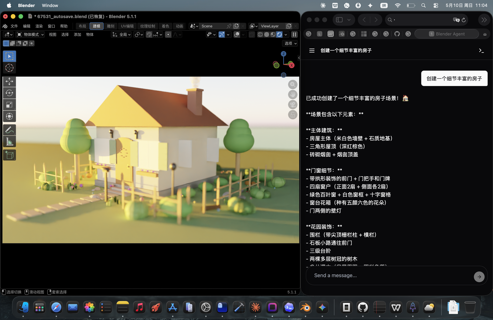

# Blender Agent



Blender Agent 是一个 Blender 插件，在 `http://localhost:6789` 启动本地浏览器工作区。通过内置的工具调用运行时，让 AI 模型检查和修改 Blender 场景。

## 主要特性

- View3D 侧边栏面板控制服务器启停
- 浏览器 UI 支持多对话、实时状态、工具时间线和 SSE 流式传输
- 支持 `Ask` / `Agent` 模式：Ask 只暴露只读查询工具，Agent 暴露完整控制工具
- 内置 OpenAI 兼容的工具调用运行时
- 支持 Blender 主线程调度
- 本地绑定，可选局域网暴露

## 安装

**发布版本：**
在 Blender 中通过 `Extensions > Install from Disk` 安装发布的 zip 文件。

**本地开发：**
```bash
ln -sfn "$PWD/blender_agent" "$HOME/Library/Application Support/Blender/5.1/scripts/addons/blender_agent"
```
修改 `5.1` 为你的 Blender 版本。然后在 3D 视口侧边栏选择 `Blender Agent` 标签，点击 `Start Blender Agent`，打开 `http://localhost:6789`。

## 模型配置

在浏览器 UI 中配置（存储在本地存储）：
- OpenAI 兼容的 API 地址
- API 密钥
- 模型名称
- 最大工具轮次

## API 端点

- `GET /api/health` - 服务器健康检查
- `GET /api/tools?mode=ask|agent` - 按模式返回 OpenAI 兼容工具模式
- `POST /api/chat/stream` - 启动代理运行并流式传输 SSE 事件
- `POST /api/runs` - 启动异步运行用于轮询客户端
- `GET /api/runs/{id}` - 获取运行状态、步骤、事件和输出

## 许可证

包含 Blender Lab 官方 `blender_mcp` 代码，详见 `blender_agent/blmcp/` 目录。
